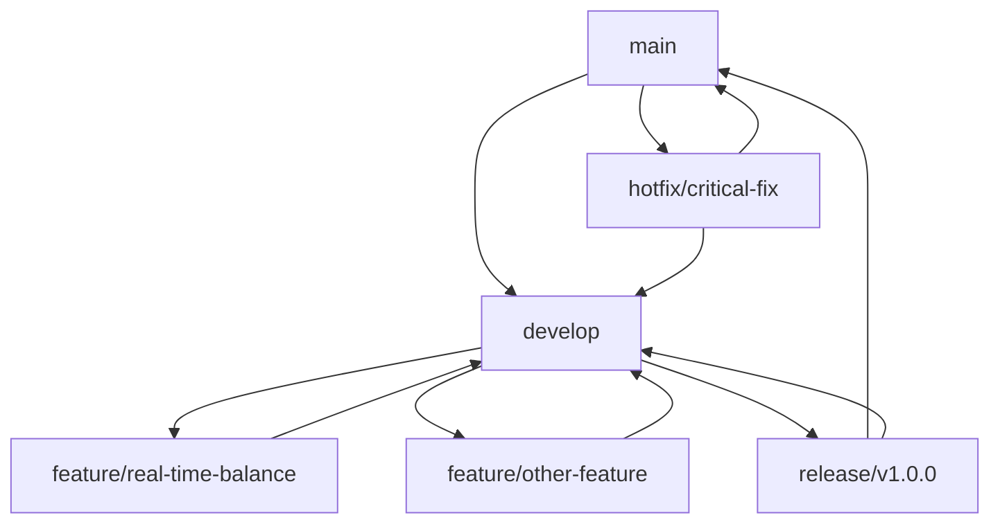

# 🔄 版本控制与部署策略

## 📋 概述

本文档定义了项目的版本控制策略、分支管理、发布流程和部署方案。

## 🌿 分支策略

### 分支类型

#### **main 分支**
- **用途**: 生产环境代码
- **保护**: 禁止直接推送，必须通过 Pull Request
- **合并**: 只能从 `develop` 或 `release/*` 分支合并
- **标签**: 每个发布版本都有对应的 Git 标签

#### **develop 分支**
- **用途**: 开发环境代码，功能集成
- **来源**: 从 `feature/*` 分支合并
- **目标**: 定期合并到 `release/*` 分支

#### **feature/* 分支**
- **用途**: 新功能开发
- **命名**: `feature/功能名称-版本号`
- **示例**: `feature/real-time-balance-v1.0.0`
- **生命周期**: 功能完成后合并到 `develop`

#### **release/* 分支**
- **用途**: 发布准备
- **命名**: `release/v版本号`
- **示例**: `release/v1.0.0`
- **来源**: 从 `develop` 分支创建
- **目标**: 合并到 `main` 和 `develop`

#### **hotfix/* 分支**
- **用途**: 紧急修复
- **命名**: `hotfix/修复描述`
- **示例**: `hotfix/fix-api-connection`
- **来源**: 从 `main` 分支创建
- **目标**: 合并到 `main` 和 `develop`

### 分支工作流



## 🏷️ 版本号规范

### 语义化版本 (SemVer)

格式: `MAJOR.MINOR.PATCH`

- **MAJOR**: 不兼容的 API 修改
- **MINOR**: 向下兼容的功能性新增
- **PATCH**: 向下兼容的问题修正

### 版本号示例

- `v1.0.0`: 第一个正式版本
- `v1.1.0`: 添加实时余额功能
- `v1.1.1`: 修复 API 连接问题
- `v2.0.0`: 重大架构变更

## 📝 提交信息规范

### 提交信息格式

```
<type>(<scope>): <subject>

<body>

<footer>
```

### 类型 (type)

- **feat**: 新功能
- **fix**: 修复问题
- **docs**: 文档更新
- **style**: 代码格式调整
- **refactor**: 代码重构
- **test**: 测试相关
- **chore**: 构建过程或辅助工具的变动

### 示例

```
feat(account): 添加实时余额获取功能

- 实现币安 API 连接器
- 实现 OKX API 连接器
- 添加自动余额更新任务
- 更新数据库模型支持实时余额

Closes #123
```

## 🚀 发布流程

### 1. 功能开发阶段

```bash
# 创建功能分支
git checkout develop
git pull origin develop
git checkout -b feature/real-time-balance-v1.1.0

# 开发完成后
git add .
git commit -m "feat(account): 添加实时余额获取功能"
git push origin feature/real-time-balance-v1.1.0

# 创建 Pull Request 到 develop
```

### 2. 发布准备阶段

```bash
# 从 develop 创建发布分支
git checkout develop
git pull origin develop
git checkout -b release/v1.1.0

# 更新版本号
# 更新 CHANGELOG.md
# 测试和修复问题

# 合并到 main 和 develop
git checkout main
git merge release/v1.1.0
git tag v1.1.0
git push origin main --tags

git checkout develop
git merge release/v1.1.0
git push origin develop

# 删除发布分支
git branch -d release/v1.1.0
```

### 3. 热修复流程

```bash
# 从 main 创建热修复分支
git checkout main
git checkout -b hotfix/critical-api-fix

# 修复问题
git add .
git commit -m "fix(api): 修复 API 连接超时问题"
git push origin hotfix/critical-api-fix

# 合并到 main 和 develop
git checkout main
git merge hotfix/critical-api-fix
git tag v1.1.1
git push origin main --tags

git checkout develop
git merge hotfix/critical-api-fix
git push origin develop
```

## 🏗️ 部署策略

### 环境分类

#### **开发环境 (Development)**
- **分支**: `develop`
- **目的**: 功能开发和集成测试
- **部署**: 自动部署到开发服务器
- **数据**: 测试数据，可重置

#### **测试环境 (Staging)**
- **分支**: `release/*`
- **目的**: 发布前测试
- **部署**: 手动部署
- **数据**: 生产数据副本

#### **生产环境 (Production)**
- **分支**: `main`
- **目的**: 正式服务
- **部署**: 手动部署，需要审批
- **数据**: 真实用户数据

### 部署流程

#### 1. 开发环境部署

```bash
# 自动触发 (GitHub Actions)
# 当 develop 分支有更新时
```

#### 2. 测试环境部署

```bash
# 手动部署
git checkout release/v1.1.0
docker-compose -f docker-compose.staging.yml up -d --build
```

#### 3. 生产环境部署

```bash
# 手动部署，需要审批
git checkout main
git pull origin main
docker-compose -f docker-compose.production.yml up -d --build
```

## 📊 版本追踪

### CHANGELOG.md 维护

```markdown
# Changelog

## [1.1.0] - 2025-08-10

### Added
- 实时余额获取功能
- 币安 API 连接器
- OKX API 连接器
- 自动余额更新任务

### Changed
- 更新账户模型支持实时余额
- 优化前端 API 配置

### Fixed
- 修复前端连接后端问题
- 修复数据库初始化问题

## [1.0.0] - 2025-08-09

### Added
- 基础套利交易系统
- 前端界面
- 后端 API
- Hummingbot 集成
```

## 🔧 工具和自动化

### GitHub Actions 工作流

```yaml
# .github/workflows/ci-cd.yml
name: CI/CD Pipeline

on:
  push:
    branches: [main, develop]
  pull_request:
    branches: [main, develop]

jobs:
  test:
    runs-on: ubuntu-latest
    steps:
      - uses: actions/checkout@v3
      - name: Run tests
        run: |
          docker-compose -f docker-compose.test.yml up --build --abort-on-container-exit

  deploy-dev:
    needs: test
    runs-on: ubuntu-latest
    if: github.ref == 'refs/heads/develop'
    steps:
      - name: Deploy to development
        run: |
          # 部署到开发环境

  deploy-prod:
    needs: test
    runs-on: ubuntu-latest
    if: github.ref == 'refs/heads/main'
    environment: production
    steps:
      - name: Deploy to production
        run: |
          # 部署到生产环境
```

### 版本管理脚本

```bash
#!/bin/bash
# scripts/release.sh

VERSION=$1
BRANCH="release/v$VERSION"

# 创建发布分支
git checkout develop
git pull origin develop
git checkout -b $BRANCH

# 更新版本号
echo "v$VERSION" > VERSION

# 更新 CHANGELOG.md
# 添加发布说明

# 提交更改
git add .
git commit -m "chore: prepare release v$VERSION"
git push origin $BRANCH

echo "Release branch $BRANCH created successfully"
```

## 📋 检查清单

### 发布前检查

- [ ] 所有测试通过
- [ ] 代码审查完成
- [ ] 文档更新
- [ ] CHANGELOG.md 更新
- [ ] 版本号更新
- [ ] 依赖项检查
- [ ] 安全扫描通过

### 部署后检查

- [ ] 服务健康检查
- [ ] 功能测试
- [ ] 性能测试
- [ ] 监控告警配置
- [ ] 备份验证
- [ ] 回滚计划准备

## 🚨 回滚策略

### 自动回滚

- 健康检查失败时自动回滚
- 性能指标异常时自动回滚
- 错误率超过阈值时自动回滚

### 手动回滚

```bash
# 回滚到上一个版本
git checkout main
git reset --hard HEAD~1
git push origin main --force

# 重新部署
docker-compose -f docker-compose.production.yml up -d --build
```

## 📈 监控和告警

### 监控指标

- 部署成功率
- 服务响应时间
- 错误率
- 资源使用率
- 用户活跃度

### 告警规则

- 部署失败告警
- 服务不可用告警
- 性能下降告警
- 错误率异常告警

---

**💡 提示**: 遵循这个版本控制策略可以确保代码质量、部署安全和团队协作效率。
