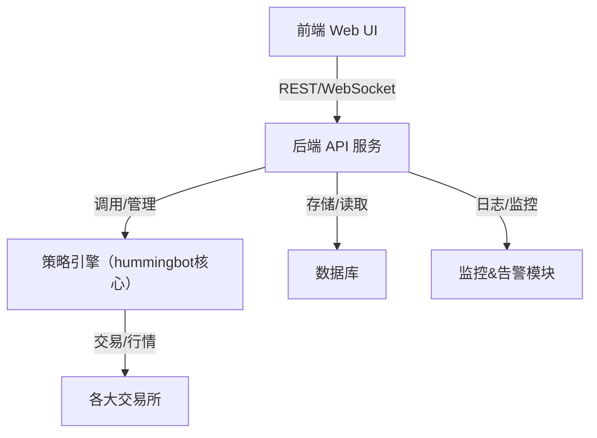

# 基于 Hummingbot 的套利策略系统设计方案

---

## 一、系统整体架构



---

## 二、核心功能点

### 1. 策略管理
- 策略列表、创建、编辑、删除
- 策略参数配置（如交易对、阈值、资金分配等）
- 策略启停、状态监控

### 2. 交易所账户管理
- API Key 管理
- 账户余额、持仓查询
- 资金划转

### 3. 实时行情与订单簿
- 实时行情展示
- 订单簿深度查看

### 4. 交易执行与监控
- 策略自动下单、撤单
- 交易记录、盈亏统计
- 风控与异常告警

### 5. 日志与回测
- 策略运行日志
- 回测功能（可选）

### 6. 用户与权限管理（可选）

---

## 三、前后端分工

### 前端（建议：React/Vue + Ant Design/Element UI）
- 策略管理界面（表单、列表、详情、启停按钮）
- 账户管理界面
- 实时行情与订单簿可视化
- 交易记录与日志展示
- 实时监控与告警弹窗

### 后端（建议：Python FastAPI/Flask + Celery + hummingbot集成）
- RESTful API（策略、账户、行情、交易、日志等接口）
- WebSocket（推送行情、策略状态、告警等）
- 策略调度与生命周期管理（可用多进程/多线程/异步）
- hummingbot核心集成与二次封装
- 数据库（如PostgreSQL/MySQL/SQLite）存储策略、交易、日志等
- 日志、监控、告警模块

---

## 四、可扩展性设计

### 1. 策略插件化
- 每个策略为独立 Python 类/模块，统一接口（如`run()`, `on_tick()`, `on_order_filled()`等）
- 策略参数通过配置文件或数据库管理
- 新增策略只需实现接口并注册即可

### 2. 交易所适配层
- hummingbot 已有丰富的交易所适配，后端只需封装调用
- 新增交易所时，扩展适配层即可

### 3. API 扩展
- RESTful API 采用版本化设计
- 新增功能时，保持向后兼容

### 4. 前端动态表单
- 策略参数表单根据后端返回的参数 schema 动态生成，便于新增策略

---

## 五、目录结构建议

```
arbitrage_system/
  backend/
    app/
      main.py
      api/
        strategy.py
        account.py
        market.py
        ...
      core/
        strategy_base.py
        strategy_loader.py
        hummingbot_wrapper.py
        ...
      models/
      db/
      utils/
    requirements.txt
  frontend/
    src/
      components/
      pages/
      api/
      App.vue / App.tsx
    package.json
  README.md
```

---

## 六、示例：策略插件接口（Python）

```python
# backend/app/core/strategy_base.py
class StrategyBase:
    def __init__(self, config):
        self.config = config

    def on_start(self):
        pass

    def on_tick(self, market_data):
        pass

    def on_order_filled(self, order_info):
        pass

    def on_stop(self):
        pass
```

---

## 七、示例：前端策略参数动态表单

- 后端返回参数 schema（如 JSON Schema）
- 前端根据 schema 渲染表单，支持不同类型参数输入

---

## 八、可选：回测与模拟

- 后端可集成回测引擎，支持历史数据回测
- 前端可展示回测结果

---

## 九、总结

- 采用插件化策略引擎，便于扩展
- 前后端解耦，API 设计规范
- hummingbot 作为底层交易执行引擎
- 支持多策略、多账户、多交易所
- 实时监控与告警，提升系统稳定性 